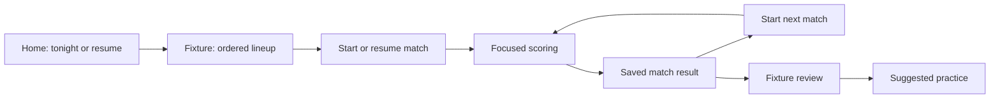

# West Green Darts App: UI and UX audit

Reviewed on **8 October 2026**, from main at `b9b9ee56a6dac2250e6bfa4a0dd0aa353bec519e`, on branch `audit/ui-ux-review`. This audit combines source reviews and browser inspection of navigation, match night, statistics, practice, Killer, administration, styling, responsive behavior and accessibility. The branch contains the audit and evidence; application changes are proposed below. Browser scoring uses an isolated local database and synthetic records.

**The application has the right features; it needs clearer destinations, stronger priorities within each screen, and consistent play/recovery flows.** The biggest improvement would be to make Home about the next useful action, Fixtures about running a match night, Practice about choosing and continuing games, and Stats about understanding performance. Preserve the club's navy, green and gold identity, its shared PIN and focused scoring.

The journeys considered are a captain arranging six matches, a scorer at the board, a player reviewing performance, a group practicing or playing Killer, and occasional roster/season management. Those use cases follow from current functionality. Their frequency and the team's actual device mix need validation with the team; this is an expert review rather than a user study.

## Agreed direction after review — 8 October 2026

Checkout guidance is **for West Green players only**. In league scoring it continues to use the West Green player's remaining score, including during the opponent's turn. Label the guidance with the West Green player's name so its ownership is clear. Keep opponent scoring available while checkout help stays exclusive to West Green players. This clarification supersedes the original recommendation to follow whichever side is active.

Add **Settings → Appearance → Dark / Light**, with the choice saved per device/browser and restored on subsequent visits. Dark remains the initial default. Apply the selected theme throughout navigation, forms, statistics, charts, scoring, checkout guidance, dialogs and results; restore it before the initial page paint to avoid flashing the other theme. Device preferences fit the shared-PIN model without requiring individual accounts.

Keep the calmer visual direction in both themes: navy surfaces with green/gold accents in Dark; light neutral surfaces, dark readable text and the same restrained club accents in Light. Define shared semantic colors for surfaces, text, borders, actions and statuses rather than relying on the current inverted palette. Verify button/text contrast, chart readability, keyboard focus, selected/disabled states and theme persistence in both appearances.

## Browser review

The existing production build passed compilation, lint, type validation and route generation. Chromium rendered **20 authenticated screens**, plus the locked PIN redirect, with additional checks at **320 × 568**, **390 × 844**, **844 × 390** and **1440 × 1000**. The dataset contains 15 synthetic players, including a long name, 12 completed six-match fixtures, scheduled/live fixtures, practice sessions and synthetic league data. There were no JavaScript page errors during the route survey.

The actual Next.js application and scoring SQL run through a restricted local REST adapter backed by PGlite. Production credentials and services are not used; external league input is synthetic. These measurements describe the tested data and viewports, not traffic, performance or screen sizes measured from your live deployment. The tied records intentionally expose how long the honours section can become.

| Browser finding | Measured evidence | Implication |
| --- | --- | --- |
| Live fixture action appears too late | **Score now at y = 1,349px** on a 390 × 844 screen; Create game at y = 1,122px | Put the active match and scoring action above analytics |
| Resume practice appears too late | Recent sessions begins at **y = 2,700px**, below player stats | Continue playing should lead the Practice hub |
| Dashboard can become extremely long | **9,644px** high; leaderboard begins at y = 8,126px with tied honours expanded | Bound Home highlights and move full honours/analysis into Stats |
| Horizontal overflow is reproducible | Dashboard **415px** wide on 390px; Doubles setup **461px** on 390px; X01 scoring **445px** on 390px; roster **368px** on 320px | Constrain selects and flex children; stack or truncate long names without pushing controls offscreen |
| West Green guidance needs an ownership label | Opponent is selected with **40** remaining, while the banner shows West's **141 out** | Keep West Green-only guidance and label it with the West Green player's name |
| Landscape behavior differs by mode | 121's full scoring layout fits **844 × 390**; league Enter remains at y = 677px | Reuse the viewport-aware layout approach across scoring modes |
| Desktop remains narrow | Main browsing column is **720px** inside a 1440px viewport | A wider browse/Stats layout would make laptops more useful |
| PIN redirect loses game identity | Opening a locked scoring URL reaches `/pin?redirect=%2Fscoring` | Preserve the full local URL and consume it after unlock |

Screenshots: [Home, first screen](ui-ux-audit/evidence/dashboard-390-viewport.png), [full Home](ui-ux-audit/evidence/dashboard-390.png), [live fixture](ui-ux-audit/evidence/fixture-live-390.png), [scheduled fixture](ui-ux-audit/evidence/fixture-scheduled-390.png), [Practice hub](ui-ux-audit/evidence/practice-390.png), [long-name X01 scoring](ui-ux-audit/evidence/practice-x01-scoring-390-viewport.png), [320px roster](ui-ux-audit/evidence/players-320.png), [West Green checkout hint during opponent turn](ui-ux-audit/evidence/league-scoring-390-viewport.png), [121 landscape](ui-ux-audit/evidence/121-landscape.png), [league landscape](ui-ux-audit/evidence/league-scoring-landscape.png), [desktop Home](ui-ux-audit/evidence/dashboard-desktop.png). The [raw browser observations](ui-ux-audit/evidence/browser-observations.json) include geometry, control sizes, computed colors and rendered text.

Keyboard review confirms that PIN digits cannot be typed directly, and Practice's hidden leg-count radio receives focus without any visible outline on its tile. Arrow-key selection works. These are targeted checks, not a screen-reader or WCAG conformance assessment. Creation and management failure paths were source-reviewed; setup writes, production save failures and offline recovery were not induced.

Five local scoring journeys were also checked through browser actions and persisted SQL state: league checkout → automatic second leg → completed match/review; X01 visit → reload → undo; 121 checkout confirmation → progression → reload; Doubles third-dart hit recording; and Random Checkout attempt → end → results. League completion exposes no Undo, while X01's existing undo restores the previous remaining score. See [local-flow observations](ui-ux-audit/evidence/interaction-observations.json) and [completed league match](ui-ux-audit/evidence/league-completed-390.png). The [focused keyboard/overflow observations](ui-ux-audit/evidence/keyboard-overflow-observations.json) identify the exact overflowing elements and focus behavior.

## What to preserve

The four-item labelled mobile navigation is a sound foundation. Focused scoring already hides navigation, emphasizes remaining points and the active thrower, and uses generous keypad controls. The shared Saving/Saved/Retry/Reload component is valuable for unreliable pub connectivity. The 121 flow also provides a useful reference for checkout confirmation, rules and focused play. Match analysis links to relevant drills, giving the app a complete review-to-improvement loop. Honours, 180s and team personality should remain, with more selective placement.

Sources: [AppShell](../src/components/AppShell.tsx#L55), [live scoring](../src/app/scoring/ScoringClient.tsx#L225), [save status](../src/components/ScoreSaveStatus.tsx#L5), [121 scoring](../src/app/practice/121/Game121Client.tsx#L172), [practice recommendations](../src/app/matches/%5BgameId%5D/page.tsx#L202).

## Proposed navigation

Keep **four mobile tabs**. Use the same destinations in a roomier desktop layout; scoring remains focused.

| Destination | Primary job | Contents |
| --- | --- | --- |
| **Home** | What should I do now? | Resume live match, tonight/next fixture, latest result, quick practice, compact team highlights |
| **Fixtures** | Prepare, run and review a match night | Upcoming/live/completed lists; date/venue; six-match lineup; scoring; final fixture and match reviews |
| **Practice** | Choose, continue and improve | X01, 121, Doubles Switch, Random Checkout; Continue playing; session history; **Pub games → Killer** |
| **Stats** | Understand performance | **Team / Players / League** subviews; leaderboards, trends, honours, real player profiles, AI summaries; exports beside the relevant data |

The header's Settings action leads to **Manage team**: roster editing, inactive players, season defaults, Dark/Light appearance and device lock. Players' performance is a Stats destination; editing players is a management task. Browsing an old season must not change the team's default season. Deep links and return paths should retain the selected season and the origin of a match review. Avoid moving an existing feature without giving it an obvious new home.

The proposed match-night journey keeps the next action visible at every step:

## Findings and recommended changes

Priority: **P1** should be addressed in the first delivery; **P2** follows as the flow is consolidated; **P3** depends on desktop usage. Effort: **S** is a contained component/copy/state change, **M** spans several screens, **L** involves route/data/lifecycle work. These are relative estimates, not delivery commitments.

### 1. Give each screen a clear navigation owner — P1 / M

The current tabs are Dashboard, Fixtures, Players and Practice. Match summaries, Seasons and Killer have no selected tab; active state is a color/glow only, with no `aria-current`. Apply the four destinations above, map deeper routes to their owning section, and use a visible selected indicator plus appropriate accessible current-location semantics. Provide a consistent labelled parent/back action. Sources: [navigation items](../src/components/AppShell.tsx#L7), [route selection](../src/components/AppShell.tsx#L107), [active styling](../src/app/globals.css#L148).

### 2. Turn Dashboard into an action-first Home — P1 / M

Six team metrics precede general shortcuts; league content, AI summary, honours, scoring breakdown, a large leaderboard, 180s, five charts and exports follow with similar card emphasis. There is a good live Resume card but no next-fixture card. The honours board renders every tied leader with full evidence; the synthetic tie-heavy dataset pushes the leaderboard more than 8,000px down the page. Put Resume/Tonight/Next fixture first, latest result second, then practice and a few team highlights. Move analytical depth into Stats; show a compact award highlight with “View all shared winners” rather than every tie on Home. Sources: [snapshot and shortcuts](../src/app/dashboard/page.tsx#L90), [analytical content](../src/app/dashboard/page.tsx#L163), [all tied leaders](../src/app/dashboard/HonoursBoard.tsx#L20), [exports](../src/app/dashboard/page.tsx#L287).

### 3. Make fixture detail a match-night workspace — P1 / M

The current page renders six summary tiles and the creation form before Score now. Completed fixtures retain a disabled Create game form and hide completed matches behind an accordion. The header lacks date/time; empty-state copy says create “below” although the form is above. Use a compact fixture header, one state-dependent primary action, and a visible ordered six-match lineup before detailed numbers. Scheduled → Start match; live → Resume scoring; completed → visible results/review. Sources: [header](../src/app/fixtures/%5Bid%5D/page.tsx#L154), [summary before creation](../src/app/fixtures/%5Bid%5D/page.tsx#L227), [scoring action](../src/app/fixtures/%5Bid%5D/page.tsx#L301), [completed accordion](../src/app/fixtures/%5Bid%5D/page.tsx#L344).

### 4. Make status, match numbers and terminology trustworthy — P1 / M

With no matches, fixture totals are 0–0 and the page says “Draw”; partial totals can declare a team win before the fixture finishes. Unfinished equal-score matches also count as draws. Live and completed lists independently number from 1, so a later match changes number after earlier matches finish. Use Scheduled/Live/Final states, final results only when settled, stable positions 1–6, and consistent terms: **Fixture** = team night, **Match** = player versus opponent, **Leg** = individual 501 game. Rename “Best of 2” to “2 legs · draw possible.” Sources: [result calculation](../src/app/fixtures/%5Bid%5D/page.tsx#L129), [draw counts](../src/app/fixtures/%5Bid%5D/page.tsx#L242), [live numbering](../src/app/fixtures/%5Bid%5D/page.tsx#L290), [completed numbering](../src/app/fixtures/%5Bid%5D/page.tsx#L358), [scoring format](../src/app/scoring/ScoringClient.tsx#L216).

### 5. Create real player profiles and compact Stats views — P1 / L

Players leads with Add player; its only detail link is Edit. Performance/history lives inside the dashboard leaderboard, in a 600px internal scroll box with many badges, bars and nested disclosures. History cards do not link to the full match review. Stats → Players should open addressable profiles with overview, matches and practice records. Use compact rank/name/form/selected-metric leaderboard rows and ordinary page scrolling; put ranking explanations and full breakdowns on demand. Sources: [player administration](../src/app/players/page.tsx#L22), [edit-only detail](../src/app/players/%5Bid%5D/page.tsx#L25), [nested scroll](../src/app/dashboard/Leaderboard.tsx#L60), [dense rows](../src/app/dashboard/Leaderboard.tsx#L111), [unlinked history cards](../src/app/dashboard/Leaderboard.tsx#L197).

### 6. Make saved practice and game discovery consistent — P1 / L

X01 sessions appear after aggregate stats with generic “Open” labels; 121 shows only five recently started active games. Doubles and Checkout save sessions but their landing pages have no resume/history links. Killer appears on Home but not in Practice. Put Continue playing above setup/statistics, use Resume/Results labels, show updated time and player/mode filters, and make all modes including Killer discoverable in one catalog. Do not hide a still-active game simply because it was started earlier. Sources: [X01 recent sessions](../src/app/practice/page.tsx#L195), [121 limit](../src/data/game121.ts#L89), [Doubles landing](../src/app/practice/doubles/page.tsx#L31), [Checkout landing](../src/app/practice/checkout/page.tsx#L30), [Killer shortcut](../src/app/dashboard/page.tsx#L154).

### 7. Standardize pause, correction, completion and retry — P1 / L

X01 has inline retry/reload and Undo; 121 confirms checkouts but lacks post-visit undo; Doubles/Checkout lack correction and can replace the page with a generic error boundary. Live match completion hides its only Undo. Killer Undo cannot reverse a hit, an eliminated life, target choice or phase transition. Apply a shared lifecycle: Pause & save, last saved action, Undo last action, End & see results, Play again and return to mode. Keep correction available after a finish with deliberate result reopening. Validate backend retry/deduplication behavior before changing it; no fault injection was performed in this audit. Sources: [X01 undo](../src/app/practice/PracticeScoringClient.tsx#L162), [async errors](../src/lib/useAsyncTask.ts#L14), [generic error copy](../src/app/error.tsx#L3), [live Undo inside incomplete state](../src/app/scoring/ScoringClient.tsx#L283), [Killer transitions](../src/lib/killerEngine.ts#L137), [Killer undo](../src/lib/killerEngine.ts#L175).

### 8. Make Doubles controls match their instructions — P1 / M

Help says tap the dart that hits, but Dart 1/2/3 are noninteractive divs. Actual entry requires sequential Miss then Hit; partial misses exist only in component state, reset before saving, and have no undo. Replace this with four visit outcomes: Hit on dart 1 / 2 / 3 and Missed all 3, showing their points. When used competitively, offer Finish current round or a round target; the current End action can award a winner before everyone has equal turns. The fairness preference needs team validation. Sources: [help](../src/app/practice/doubles/page.tsx#L37), [partial state/submission](../src/app/practice/doubles/DoublesGameClient.tsx#L45), [actual controls](../src/app/practice/doubles/DoublesGameClient.tsx#L80), [noninteractive dart slots](../src/app/practice/doubles/DoublesGameClient.tsx#L242), [ranking](../src/app/practice/doubles/DoublesGameClient.tsx#L114).

### 9. Explain X01 setup and its real format — P1 / S–M

The hub's generic Start a session form starts X01 without naming it. Player choices allow blank/duplicate players and include inactive teammates without explanation. “Best of 3/5/7” actually plays every requested leg. Make X01 a named mode, explain solo/two-player and team/guest choices, default to active players and prevent accidental duplicate selections. For training volume, say “Play 3 legs”; if competition is intended, stop when the match is clinched. Preserve the meaning of historical results. Sources: [setup](../src/app/practice/page.tsx#L63), [format labels](../src/app/practice/page.tsx#L105), [nullable player submission](../src/app/practice/actions.ts#L9), [completion logic](../supabase/migrations/20260908193204_audit_scoring_and_access_fixes.sql#L135).

### 10. Clarify what scoring controls act on — P2 / S–M

Live checkout guidance uses West Green's remaining score even when the opponent is selected; this is reproduced in the browser at West 141 / opponent 40 and is the intended team-only behavior. Make the banner explicitly say whose checkout it describes. An active-match “Summary” link lands at the keypad. Quick score chips submit instantly, while digits require Enter. X01's dash represents both unentered and zero, and Enter can submit zero immediately. Keep guidance exclusive to West Green players, target the actual summary, identify one-tap actions clearly, and distinguish no input from an explicit Miss/0. Keep last saved player/score visible. The league Enter key also computes to the same dark surface as the other keys, despite its green utility class; give the primary submit a consistent accessible visual treatment. Sources: [checkout hint](../src/app/scoring/ScoringClient.tsx#L126), [Summary link](../src/app/fixtures/%5Bid%5D/page.tsx#L310), [keypad anchor](../src/app/scoring/ScoringClient.tsx#L284), [quick submit](../src/app/scoring/ScoringClient.tsx#L300), [X01 entry](../src/app/practice/PracticeScoringClient.tsx#L346), [keypad styles](../src/app/globals.css#L238).

### 11. Preserve shared links through PIN and support shared devices — P1 / M

Middleware remembers only pathname, losing scoring/session queries; PIN success always opens Dashboard. Return to the full validated local destination after unlock. Keep the 30-day session but add Lock this device in Settings. PIN currently uses a button-only keypad and four default dots despite supporting up to eight digits; add an accessible numeric input with keyboard/paste/Enter and appropriate length/help guidance. Avoid introducing a new account model for this UI work. Sources: [redirect](../src/middleware.ts#L17), [PIN destination](../src/app/pin/page.tsx#L32), [length/dots](../src/app/pin/page.tsx#L8), [keypad](../src/app/pin/page.tsx#L64), [30-day copy](../src/app/pin/page.tsx#L50).

### 12. Distinguish saving, failure, empty data and demo data — P1 / M

Creation forms generally lack pending feedback. Practice and several management actions return silently on failure; creating a fixture match revalidates but does not open scoring. Player loading can fall back to sample names on any database error, while failed practice reads appear empty. Share Starting/Saving, disabled pending submit, accessible success/error messages and preserved inputs; open the newly started game. Use explicit failed-load/retry states, reserving sample data for labelled demo mode. Production outages were not induced; these fallback paths are code-confirmed. Sources: [fixture submit](../src/app/fixtures/CreateFixtureForm.tsx#L118), [match success](../src/app/fixtures/%5Bid%5D/actions.ts#L139), [silent practice failure](../src/app/practice/actions.ts#L14), [player fallback](../src/data/players.ts#L34), [practice read fallback](../src/data/practice.ts#L78).

### 13. Separate destructive actions from routine play — P1 / M

Delete fixture sits beside Open; match deletion sits beside scoring/summary without confirmation. Player deletion is one submit once inactive, without explaining historical consequences; X01 exposes deletion in its scoring surface. Put destructive actions in management/overflow, confirm the named target and consequences, and support undo/restore where existing soft deletion permits it. Treat deactivate/archive as the normal way to retire a player and explain retained history. Sources: [fixture actions](../src/app/fixtures/page.tsx#L141), [live match delete](../src/app/fixtures/%5Bid%5D/page.tsx#L318), [match soft deletion](../src/app/fixtures/%5Bid%5D/actions.ts#L175), [player delete](../src/app/players/%5Bid%5D/page.tsx#L100), [practice delete](../src/app/practice/PracticeScoringClient.tsx#L426).

### 14. Separate season browsing from team administration — P2 / M

Fixture filters are view-only, but the detail back link loses them. Dashboard only uses the team's globally active season. Settings and Seasons duplicate default management and mix Current/Active wording; “add / remove” links to a page with no remove action. Use a common view-only season selector in Fixtures, Stats and profiles, preserve it through details, and label the shared setting Team default season. Consolidate roster/seasons under Settings/Manage team with clear outcomes and back paths. Sources: [filter URL](../src/app/fixtures/SeasonFilter.tsx#L27), [lost return context](../src/app/fixtures/%5Bid%5D/page.tsx#L157), [global dashboard season](../src/app/dashboard/page.tsx#L22), [default setting](../src/app/settings/page.tsx#L24), [overpromised link](../src/app/settings/page.tsx#L73), [season page](../src/app/seasons/page.tsx#L17).

### 15. Fix primary-action contrast — P1 / S

White text on the configured green has calculated contrast of **3.12:1 normally** and **2.55:1 on hover**, below 4.5:1 for typical 14–16px button labels. Computed browser colors confirm the normal fill. Doubles' enabled Add button uses white text on inverted `slate-800` (`#e2eaf6`), producing **1.21:1** contrast. The inverted palette makes some hover fills brighter too. Use accessible semantic action colors: darker green/white or bright green/dark text, and update legacy primary/secondary controls together. Existing brand green `#227256` gives 5.82:1 with white. Check computed colors for all interaction states during implementation. Sources: [shared button](../src/app/globals.css#L160), [hover](../src/app/globals.css#L164), [exact green colors](../tailwind.config.ts#L39), [legacy button](../src/app/players/page.tsx#L44), [Doubles Add](../src/app/practice/doubles/DoublesStartForm.tsx#L57). [Enabled Add screenshot](ui-ux-audit/evidence/doubles-add-enabled-390.png).

### 16. Keep the brand, calm the visual hierarchy and support Dark/Light — P2 / M

Every card uses a gradient, border, blur and large shadow; nested cards, many chips, varying radii and legacy utility combinations compete for attention. Keep navy, green, gold and the logo. Use flatter grouped rows for lists/history, one elevated priority panel, restrained gold for achievement, 16px body text, 13–14px metadata, tabular numbers and one outline icon set. Define semantic color/spacing tokens for both Dark and Light and shared Header, Button, Field, ListRow, Stat and Status components. Add the per-device Appearance choice described above, including all focused scoring screens and chart colors. Mode colors should be accents rather than a different interaction language. Sources: [card style](../src/app/globals.css#L53), [shared controls](../src/app/globals.css#L158), [legacy fields](../src/app/fixtures/CreateFixtureForm.tsx#L41), [palette remapping](../tailwind.config.ts#L3), [white remapping](../src/app/globals.css#L48).

### 17. Improve phone rows and make desktop space useful — P2 mobile / P3 desktop; M

Roster and fixture rows combine long names, metadata and multiple controls in nonwrapping flex layouts; several targets are 28–36px. Browser overflow is confirmed for the roster at 320px and for X01 score panels at both 320/390px. The Dashboard scoring-player select and Doubles player select retain their intrinsic long-option width; the latter pushes Add completely offscreen. Make the row a generous navigation target, constrain select/flex widths, stack metadata beneath its title, move secondary actions into a menu and aim for 44–48px effective controls. Browsing is capped at 720px even on desktop with the fixed bottom bar; allow wider Stats/Fixtures layouts and desktop navigation while keeping scoring compact. Sources: [roster row](../src/app/players/page.tsx#L61), [fixture title/date](../src/app/fixtures/page.tsx#L131), [36px actions](../src/app/fixtures/page.tsx#L143), [Dashboard select](../src/app/dashboard/ScoringBreakdown.tsx#L46), [Doubles select](../src/app/practice/doubles/DoublesStartForm.tsx#L39), [Killer 28px controls](../src/app/pub-games/killer/KillerClient.tsx#L215), [page width](../src/app/globals.css#L35), [fixed nav](../src/app/globals.css#L108).

### 18. Finish the accessibility and local-game details — P2 / M

Practice's hidden radio inputs lack visible focus on their tiles and a fieldset/legend. Native Tab focus also leaves **44.5px of a 66px option tile covered by the fixed bottom navigation**; give focused controls scroll clearance as well as a visible focus ring. Charts use horizontal names and tooltip values without a text/table equivalent; Recharts has built-in accessibility, so actual keyboard/screen-reader behavior still needs checking. Live ping markers and Killer shuffle need reduced-motion handling. Killer saves one game only on the current device without a storage indicator, has no early rules/roster shortcuts, silently ignores duplicate names, and keeps global navigation during play. Add meaningful chart values/data alternatives, static motion-reduced states, accessible lives/eliminated/thrower labels, and explicit Saved on this device / Resume / New game / rules/help. Use the same focused play shell as other modes. Sources: [radios](../src/app/practice/page.tsx#L116), [global focus/motion](../src/app/globals.css#L400), [charts](../src/app/dashboard/BarChartCard.tsx#L32), [live ping](../src/app/fixtures/page.tsx#L115), [Killer storage](../src/app/pub-games/killer/KillerClient.tsx#L27), [duplicate input](../src/app/pub-games/killer/KillerClient.tsx#L244), [shuffle](../src/app/pub-games/killer/KillerClient.tsx#L323). [Focused option screenshot](ui-ux-audit/evidence/practice-keyboard-focus-390.png).

## Suggested phone screen hierarchy

**Home:** compact brand/title → Resume live match or Tonight/Next fixture with opponent/date/venue and one action → latest result with View fixture → Start practice → three team highlights and View Stats. A popular Killer shortcut may remain here as well as in Practice. Detailed charts, exports and administration should have clear destinations elsewhere.

**Fixture:** opponent, home/away, date/venue, Scheduled/Live/Final → current leg score and completed matches out of six → Start/Resume/Next match → lineup positions 1–6 with player names, status and result → optional fixture numbers and review. For a completed night, replace start controls with the final result and visible lineup/review. Expandable detail must not hide the main purpose of the screen.

**Player profile:** name and season selector → recent form plus three useful metrics → Matches / Practice tabs → chronological linked history → trends and recommendation → secondary equipment/details and Manage player. Keep administrative controls out of the performance header.

**Practice:** Continue playing → mode catalog including Pub games → concise setup/rules → focused play with current player/target, score entry, last saved action and Undo → Pause/End → useful result, Play again and history. Distinguish local-only Killer saving from cross-device sessions.

## Phased delivery

| Phase | Work | Result |
| --- | --- | --- |
| **1. Correct confusing behavior** | Destination-preserving PIN; honest fixture states/stable numbering; Doubles controls; X01 labels; accessible primary button colors; form feedback; safer delete placement; West Green-labelled hints and correct link labels | Users trust outcomes and know what each action did |
| **2. Reorganize the main experience** | Four tabs; action-first Home; state-aware fixture layout; Stats Team/Players/League; player profiles; Settings/Manage team and per-device Dark/Light appearance; season context; exports near data | Each existing feature has a predictable home and frequent actions are easy to find |
| **3. Unify every play mode** | Continue/history; Pause/End/Results; undo across phases and after finishes; inline save recovery; Killer persistence/rules; consistent setup | Starting, returning, correcting and finishing behave consistently |
| **4. Polish and verify** | Shared visual primitives and both theme palettes; calmer surfaces; phone rows/touch/focus; readable charts; reduced motion; theme persistence and first-paint checks; broader tablet/desktop layout as warranted | The app feels coherent across devices and interaction methods |

The phases describe the recommended order, not a request to remove features or rewrite scoring wholesale. State/history changes should be evaluated against existing data and implemented on an isolated test dataset before any live migration.

## Acceptance criteria

- A returning scorer sees Resume/Tonight before detailed analytics at a normal phone viewport.
- A scheduled fixture shows Not started; an incomplete fixture shows a live score; a final result appears only after all required matches settle.
- Match positions 1–6 remain stable after completion, deletion/replacement and page reload.
- Starting a match opens its scoring screen; finishing it offers the next match and fixture result without hunting through summary cards.
- A locked fixture, match, practice or scoring deep link returns to the same full destination after PIN entry.
- Stats → Players opens a real profile; every match-history item links to the appropriate review and returns to its original season/context.
- Looking at a historical season never changes the team's shared default season.
- All saved active modes can be rediscovered and resumed; Pause, End and Delete have clearly different effects.
- A wrong visit, finish or consequential Killer action can be corrected deliberately; retries cannot create duplicate attempts when a saved response is lost.
- Doubles instructions match operable controls; X01 plays exactly the format promised in setup.
- Pending saves are visible; errors preserve the task and inputs; unavailable data does not appear as a true empty record or an unlabelled sample roster.
- Destructive actions identify the affected record and consequences; normal roster retirement retains history.
- Checkout guidance remains exclusive to West Green players and clearly names the player it helps, including during the opponent's turn.
- Settings offers Dark and Light; the device/browser choice survives reload, navigation, PIN unlock and later visits without changing other devices' preferences.
- Both themes cover every screen, including charts and focused scoring, and appear correctly on the initial paint.
- Normal button text meets 4.5:1 contrast and large text meets 3:1 in both themes; key controls have visible keyboard focus and sufficient touch spacing.
- Verify 320/375/390px widths, long names, 200% text scaling, phone landscape, safe areas, tablet and desktop; no essential action depends on clipped text or a competing internal scroll region.
- Keyboard and screen-reader checks cover navigation, setup, scoring, checkout prompts, result/correction and charts. Reduced-motion users retain every state/action without continuous motion.
- Run complete start → score → pause → resume → correct → finish → results → history flows for each mode on non-production data, including slow/disconnected/save-response-loss recovery.

## Scope and remaining validation

This is an expert UI/UX audit and proposed improvement plan. The four-tab structure and screen priorities are design recommendations. Desktop priority, Doubles competition rules, anonymous/guest practice and the exact visual density should be validated with the team's real usage. Rendered screens, targeted keyboard behavior and local scoring flows are checked; actual-device safe areas, 200% text scaling, a screen reader, production database behavior, offline/lost-response recovery and user task testing remain implementation validation work. Application changes have not been implemented.
